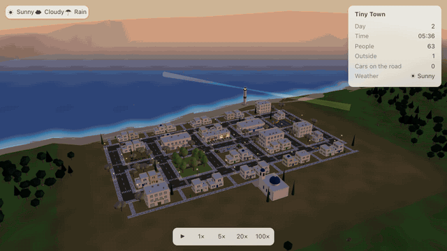

# Tiny Town

A 3D tiny town that lives by itself. Sixty-three people in a white village above the sea go
to work, meet at the cafe, drive home, light their windows and sleep, and the sky, the
weather and a lighthouse keep time over them.



_A day at 20x, from dawn to dawn._

**Live demo:** _coming with the first tagged release; see Deploying below._

## What it is

- A fixed-step simulation of a small town: 63 citizens with jobs, families, friends and
  a personality that tilts their day; 8 vehicles; a road and a pavement graph with A\*
  routing; weather that changes what people do, not just how it looks.
- A Three.js renderer of a miniature Greek island village: white cubes on a slope, blue
  domes, a church and a lighthouse, olives and cypresses, a sea with a glint path, a sky
  with a sun, clouds, a Tekapo night of stars and a moon.
- A restrained UI: weather, the town's status, a diary of causes ("Because of the rain,
  June and Sam gave up on the park and went to the cafe instead."), a citizen panel, and
  Follow.

Open the page and do nothing: at 5x a good day plays out in about five minutes. Tap a
person to see who they are; Follow them through the day.

## Running it

```bash
npm install
npm run dev       # dev server on http://localhost:5173
npm test          # Vitest, including a headless 30 day run
npm run lint
npm run build     # typecheck and production build into dist/
```

Hidden keys for power users: `1` `2` `3` `4` set the speed, space pauses, `S` `C` `R` set
the weather, `Q` cycles the quality tier.

## Architecture

The rule that shapes everything: **`src/simulation/` never imports Three.js.** The world
runs in Node with no renderer attached, which is how the tests run a month of town life
in a few seconds.

```
src/
├── simulation/   World, TimeSystem, CitizenSystem, VehicleSystem, WeatherSystem,
│                 ScheduleSystem, Navigation (A*), EventLog, Rng — pure logic
├── entities/     Citizen, Vehicle, Building, geometry — data types
├── world/        Town layout, Population, Fleet, Terrain — the fixed data of the place
├── render/       App, TownView, CitizenView, VehicleView, Environment (sky), Scenery,
│                 Wildlife, Rain — Three.js, reads the simulation, never writes it
├── ui/           Ui, phrases — DOM over the canvas, reads the world once a frame
└── main.ts
tests/            architecture, headless month, citizens, vehicles, navigation,
                  weather, determinism, ui phrases
```

**Fixed ticks.** The simulation advances in ticks of a tenth of a game minute.
`World.tick()` takes no arguments. Speed is a number of ticks per frame, never a scaled
delta time, so 1x and 100x run the same code the same number of times.

**Determinism.** Every random choice goes through a seeded generator, forked by label. The
same seed gives the same town at 1x and at 100x, to the state hash, with the weather
scripted into the run; a test checks it. Anything that moves on real time (clouds, swell,
stars, animals, umbrellas opening) lives on the render side and never touches the state.

**Headless tests.** A 30 day run asserts that nobody stands in the open for more than 30
game minutes, nobody leaves the map, fewer than a tenth of shifts start late, every
entrance is reachable, no two cars overlap for long, and rain empties the park and fills
the cafe. CI runs lint, format, tests and the build on every push.

**Instancing.** The whole town is about 85 draw calls: every repeated shape (a window
pane, a wall, a tree crown, a lamp, a citizen's arm, a raindrop) is one instanced mesh
with a colour per instance.

## Deploying

The site is hosted on Vercel. `.github/workflows/deploy.yml` builds, tests and publishes
to production on every `v*` or `phase-*` tag, with the Vercel CLI in prebuilt mode, so a
tag is the release. It needs one repository secret, `VERCEL_TOKEN`. `vercel.json` holds
the build settings; the build uses relative asset paths, so it also works from any static
host or a subdirectory.

## Assets and licensing

Everything on screen is generated in code: there are no models, textures or sound files.
The two textures (grass blotch and stone paving) are drawn at start-up from seeded noise.
System fonts. No third party assets, so nothing to attribute beyond the libraries in
`package.json`.

Code is released under the [MIT License](LICENSE).

## Documents

- `SPEC.md` — the requirements, the single source of truth (in Chinese).
- `DESIGN.md` — the visual direction.
- `PHASES.md` — the phase by phase plan; `CHANGELOG.md` — what each phase did.
